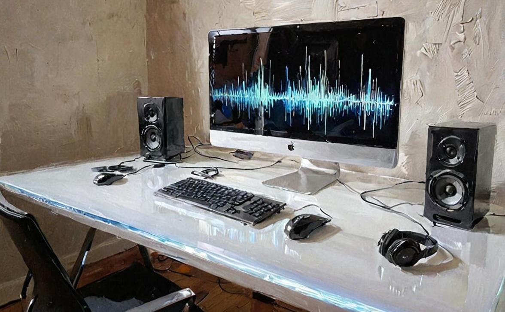

# chaudio

> Switch your Mac's microphone and speakers together with one short command, like `chaudio s h`.



## Summary

On a Mac, moving from a headset call to speakerphone means two trips into Sound settings: one for the input, one for the output. **chaudio** (change audio) lets you name those pairings once, give them short aliases, and switch with a single command. Each named option can set the input, the output, or both, adjust the output level, and run your own shell commands, for example pausing music when you pick up a call. It is a small PHP command-line app over existing macOS audio switchers, so the operating system still does the actual switching, and your configuration and device lookups are cached so each switch runs quickly.

## Quick Start

Install into `~/opt/chaudio`, add the default audio engine, and link the command onto your `$PATH` (this assumes `~/bin` is on it, and that your default `php` is 8.1 or newer; if it is not, see [Using a different PHP](#using-a-different-php)):

```shell
mkdir -p ~/opt && cd ~/opt
composer create-project aklump/chaudio:">=0.0.14 <0.1" --repository='{"type":"github","url": "https://github.com/aklump/chaudio"}'
cd chaudio && npm install
ln -s ~/opt/chaudio/chaudio ~/bin/chaudio
```

Print the configuration file's path. The first run creates it from the defaults:

```
$ chaudio config
✏️ /Users/you/.chaudio.yml
```

The default options use your Mac's built-in devices, so you can switch right away. To add your own USB or Bluetooth devices, list them with `chaudio devices` (this needs the default engine you just installed) and copy their UIDs, following the commented examples in that file:

```
$ chaudio s h
🎧 Headphones is active (🔈 External Headphones)
$ chaudio s m
🔊 MacBook is active (🎙 MacBook Pro Microphone  🔈 MacBook Pro Speakers)
```

Run `chaudio -h` at any time to see the commands, and `chaudio <command> -h` for the details of one.

### Check that it works

The message chaudio prints only says it *ran* the switch. To see the change for yourself, watch macOS while you switch:

1. Open **System Settings > Sound** and pick the **Output** tab (or **Input**, if the option you are testing sets a microphone).
2. Click a device in the list that is *not* the one you are about to switch to, so you start from a known state.
3. Run the switch, for example `chaudio s h`, without closing the window.
4. The highlighted device in the list changes to the one your option names. If it does, chaudio is working. To test the Alfred workflow, do the same but type `chauds h` in Alfred instead.

If the highlight does not move, run the switch again with `-v` (`chaudio s h -v`) to see the engine and each command that was run. A device that cannot be found, such as a Bluetooth headset that is turned off, is reported on stderr and leaves your audio unchanged, so check that the device is connected and listed by `chaudio devices`.

## Requirements

- macOS. Every supported audio engine is a macOS tool.
- PHP 8.1 or newer with the `json` extension, and Composer. It does not have to be your default `php`; see [Using a different PHP](#using-a-different-php).
- One audio engine (see [Installation](#installation)). The default engine needs Node.js with npm or Yarn.

## Installation

chaudio is installed from its GitHub repository, <https://github.com/aklump/chaudio>. In a terminal, change to where you want the app to live (the examples use `~/opt`), then install it with Composer:

```shell
composer create-project aklump/chaudio:">=0.0.14 <0.1" --repository='{"type":"github","url": "https://github.com/aklump/chaudio"}'
```

This creates a `chaudio` folder (that is the package name). Link its `chaudio` script into a directory on your `$PATH`, such as `~/bin`:

```shell
cd ~/bin
ln -s ~/opt/chaudio/chaudio .
```

### Using a different PHP

chaudio remembers which PHP ran Composer when you installed it, and keeps using that PHP, even from the Alfred workflow, which does not load your shell's aliases, `$PATH` changes or phpenv. It writes that choice to `.php-version` in the `chaudio` folder. So if your default `php` is older than 8.1, run the install under a newer one.

**With [phpenv](https://phpenv.org/)**, choose the version for the install, and its name is recorded, as `phpenv local` would:

```shell
PHPENV_VERSION=8.3 composer create-project …
```

To change it later, run `phpenv local 8.4` in the `chaudio` folder.

**Without phpenv**, run Composer with the newer PHP's full path, and that path is recorded:

```shell
/opt/homebrew/opt/php@8.3/bin/php "$(command -v composer)" create-project …
```

Replace `…` with the rest of the `create-project` command above. A Homebrew PHP is recorded by its `opt` path, which survives `brew upgrade`. If that PHP moves, edit the path in `.php-version`, or reinstall. A path is not something phpenv understands, so if you adopt phpenv later, run `phpenv local` in the `chaudio` folder to replace it with a version name.

chaudio picks its PHP in this order:

1. The `CHAUDIO_PHP` environment variable, for example `CHAUDIO_PHP=/usr/local/opt/php@8.4/bin/php chaudio s h`.
2. `.php-version`: a path is run as is; a version name runs that phpenv version from `~/.phpenv/versions` (or `$PHPENV_ROOT/versions`), without needing phpenv's shims on your `$PATH`.
3. The first `php` on your `$PATH`.

If the PHP it picks is missing, chaudio prints the path it tried. If it is too old, chaudio stops with an error that names the version it needs.

### Audio engine

chaudio looks for an engine in the following order and uses the first one it finds. The order is fixed; no setting prefers a different engine when more than one is installed.

1. [macos-audio-devices](https://github.com/karaggeorge/macos-audio-devices), the default, and the only engine that can set output levels or list your devices. It is declared in `package.json`, so run `npm install` (or `yarn install`) inside the `chaudio` folder.
2. [switchaudio-osx](https://github.com/deweller/switchaudio-osx), when its `SwitchAudioSource` command is on your `$PATH`.
3. [SwitchAudio](https://www.macscripter.net/t/switchaudio-a-command-line-tool-to-change-the-audio-input-and-output-device/75630/1), when it is installed as an executable at `~/bin/SwitchAudio`.

Only macos-audio-devices can list your devices. Under either of the other two, `chaudio devices` says that listing is unsupported and exits with status 1, so you will need the device names from System Settings.

### Alfred workflow

The repository also holds `Change Audio.alfredworkflow`. Double-click it to add the workflow to [Alfred](https://www.alfredapp.com), then type `chauds` followed by a label or alias (`chauds b`) to switch without opening a terminal. The workflow runs `~/bin/chaudio switch "$1" 2>&1`, so it expects the symlink above at exactly that path. Error messages, which chaudio writes to stderr, are merged into the output so that they appear in the notification too.

The keyword is `chauds`, not `chaudio switch`, on purpose: Alfred is for quick, repeated switching, so the keyword is as short as it can be while still being memorable, and it does only one job, switching (the `s` stands for switch). In a terminal you use the full `chaudio switch <label>` (or `chaudio s <label>`), because there the command name also gives you `devices`, `config` and `cache:clear`, and a self-describing command is easier to remember and to use in scripts. The workflow still calls `switch` by its full name, so it behaves exactly like the terminal command.

### Updating

Delete the `chaudio` folder you installed earlier, then repeat the installation, including the audio engine and, if you used one, the [different PHP](#using-a-different-php). Your configuration lives in your home directory, so deleting the folder does not remove it.

## Configuration

Run `chaudio config` to print the configuration file's path, which is `~/.chaudio.yml`. If the file does not exist, chaudio creates it from the defaults shown below. Open it and edit the `options` list, which needs at least two entries.

```yaml
# Each option is a preset. Switch to one with `chaudio s <alias>`, or run
# `chaudio s` and pick one with the cursor keys. Run `chaudio devices` to see
# your devices' names and UIDs.
#
# Start a label with an emoji to spot it quickly in the list, for example:
#   🎧 headphones   🔊 speakers   🎤 microphone   👥 meetings   📞 calls
# An emoji is part of the label, so `chaudio s headphones` will not find
# "🎧 Headphones". Give every option an alias to type instead.
options:
  - label: '🎧 Headphones'
    aliases: [ h, hp ]
    output:
      uid: BuiltInHeadphoneOutputDevice
      level: 0.25

  - label: '🔊 MacBook'
    aliases: [ m, mb ]
    input:
      uid: BuiltInMicrophoneDevice
    output:
      uid: BuiltInSpeakerDevice

  # The devices above are built into every Mac, so their UIDs are the same on
  # yours. The examples below use made-up devices: replace the names and UIDs
  # with your own from `chaudio devices`, then remove the leading `# `.
  #
  # An option may set both an input and an output, and run scripts afterward.
  # - label: '👥 Meetings'
  #   aliases: [ z ]
  #   input:
  #     name: USB Webcam
  #     uid: 'AppleUSBAudioEngine:Acme:USB Webcam:1234567:3'
  #   output:
  #     name: USB Speaker
  #     uid: 'AppleUSBAudioEngine:Acme:USB Speaker:ABC123XYZ:1'
  #   scripts:
  #     - nowplaying-cli pause
  #
  # An option may set only an input...
  # - label: '🎤 Studio microphone'
  #   aliases: [ mic ]
  #   input:
  #     uid: 'AppleUSBAudioEngine:Acme:USB audio CODEC:7654321:2'
  #
  # ...or only an output. Bluetooth devices are identified by their address.
  # - label: '🎧 Bluetooth headphones'
  #   aliases: [ bt ]
  #   output:
  #     name: Acme BT-100
  #     uid: 'AA-BB-CC-DD-EE-FF:output'
```

Each option takes these keys:

- `label` (required) is the name you type, matched case-insensitively. A label with spaces, such as `Desk Setup`, is typed quoted (`chaudio s "desk setup"`) or with underscores (`chaudio s desk_setup`).
- `aliases` are shorter names for the same option.
- `input` and `output` each identify a device with a `name` (as in the `Name` column of `chaudio devices`, or the device's number) or with a `uid` (see below), or both (the `uid` is used, and the `name` is kept for reading and for engines that cannot use a UID), plus an optional `level` from 0 to 1. An option needs at least one of the two; leave one out to change only the other. Only the macos-audio-devices engine applies `level`, and only to the output; a `level` on `input` is accepted but ignored.
- `scripts` are shell commands run after the switch. The `nowplaying-cli pause` in the default config's commented Meetings example needs [nowplaying-cli](https://github.com/kirtan-shah/nowplaying-cli), which you install separately; remove that line if you don't use it. If a script fails, chaudio reports it and exits with status 1.

### Identifying devices: prefer `uid`

Every device has a UID, an identifier assigned by macOS that survives a restart. Copy it from the `UID` column of `chaudio devices` and use it in place of `name`:

```yaml
- label: Desk
  output:
    name: MacBook Pro Speakers     # optional; a readable name, used if uid is omitted
    uid: BuiltInSpeakerDevice      # used when present
    level: 0.5
```

A name is the next best choice, but two devices can share a name (in which case the first is used), and macOS or you can rename a device. A device number is the least reliable, because macOS reassigns those when the computer restarts.

A `uid` works with macos-audio-devices and with `SwitchAudioSource` (which matches it as a substring, so paste the whole UID). The `~/bin/SwitchAudio` engine cannot be verified to understand UIDs, so it uses the `name` when you give both, and otherwise stops the switch with a message.

If a device cannot be found, for example a Bluetooth headset that is disconnected, chaudio prints what it could not find on stderr, leaves your audio unchanged, and exits with status 1.

The file is validated against `json_schema/config.schema.json` before it is cached. A file that does not fit the schema stops the switch and prints what is wrong:

```
❌ Invalid configuration:
⚠️ "/options" -- Array should have at least 2 items, 1 found
```

### Cache

chaudio caches the validated configuration and the device lookups in `$TMPDIR/com.aklump.chaudio`. Editing the configuration file is picked up automatically, because the cached copy is checked against the file on every run. Run `chaudio cache:clear` after connecting a new device, or add `--refresh` to a switch to clear the cache and switch in one step. The cache holds nothing you cannot rebuild, so deleting the folder is always safe.

## Usage

```
chaudio                       list the commands (same as -h and --help)
chaudio <command> -h          help for one command
chaudio -V                    print the name and version
chaudio switch <label>        switch to a configured option (alias: s)
chaudio s                     choose an option with the cursor keys (or list them when not in a terminal)
chaudio s <label> --refresh   clear the cache, then switch
chaudio s <label> -v          switch, and print the engine, cache directory and commands run
chaudio devices               list every audio device, with UIDs (alias: d)
chaudio config                print the configuration path, creating the file if missing
chaudio cache:clear           clear the cache (alias: cc)
```

`<label>` is a label or an alias from your configuration. The built-in `list`, `help`, and `completion` commands are available too, and command names can be abbreviated to any unique prefix (`chaudio sw h`). Normal output goes to stdout and errors to stderr; the exit status is 0 on success and non-zero otherwise, so scripts can rely on it.

In a terminal, `chaudio s` lets you pick an option with the cursor keys. When output is piped, it lists one option per line with its aliases in parentheses:

```
$ chaudio s
🔹 🎧 Headphones (h, hp)
🔹 🔊 MacBook (m, mb)
```

Listing your devices marks the ones your options use. The `UID` column is what you copy into a `uid` key; a name in your config marks every device that has that name:

```
$ chaudio devices
+--------+-----+----------------------------+------------------------------+-----------------+
| Type   | ID  | Name                       | UID                          | In your options |
+--------+-----+----------------------------+------------------------------+-----------------+
| output | 98  | External Headphones        | BuiltInHeadphoneOutputDevice | 🎧 Headphones  |
| output | 71  | MacBook Pro Speakers       | BuiltInSpeakerDevice         | 🔊 MacBook      |
| input  | 62  | MacBook Pro Microphone     | BuiltInMicrophoneDevice      | 🔊 MacBook      |
| output | 126 | LG UltraFine Display Audio | AppleUSBAudioEngine:...      | -               |
+--------+-----+----------------------------+------------------------------+-----------------+
```

If a name matches nothing, chaudio says so and suggests the nearest match:

```
$ chaudio s hedphones
❌ Unknown audio configuration: hedphones
🤔 Did you mean "🎧 Headphones"? (chaudio s)
```

When a Bluetooth device is disconnected, switching to an option that uses it fails and leaves your audio unchanged; reconnect it and run `chaudio s <name> --refresh` to rebuild the cache and switch in one step. Not every device responds to level control, so a configured `level` may have no effect on some hardware.

For a shorter command, add an alias to your shell profile, for example `alias chaud='chaudio s'` in `~/.zshrc`, then type `chaud h`. Aliases do not apply to Alfred or scripts, which should call `chaudio` directly.

## Support

## Support My Open Source Work

If you’ve found this project useful, please consider supporting its ongoing maintenance. Even a small contribution helps fund updates, fixes, and new ideas.


  * [Sponsor on GitHub](https://github.com/sponsors/aklump)

  * [Buy Me a Coffee](https://buymeacoffee.com/aklump)

  * [paypal.com](https://www.paypal.com/cgi-bin/webscr?cmd=_s-xclick&hosted_button_id=4E5KZHDQCEUV8&item_name=Open%20Source%20Sponsorship)


## License

[BSD-3-Clause](LICENSE)
