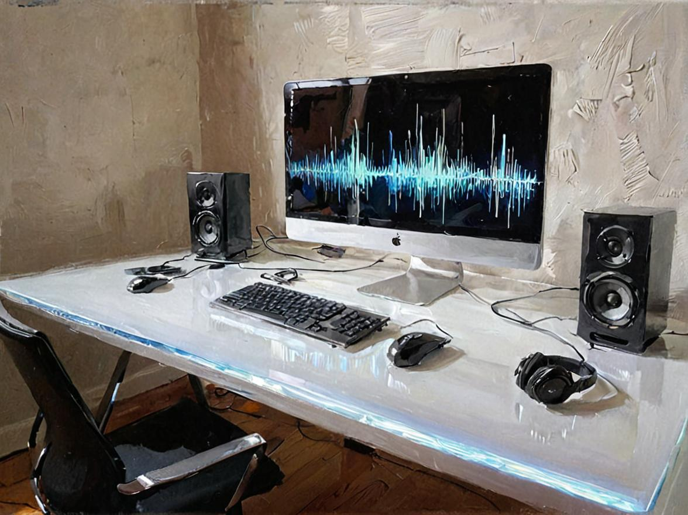

<!--
id: readme
tags: ''
-->

# Change Audio (chaud)



A configurable, command-line tool to easily switch between different audio configurations. This is different from other solutions because you create names (and aliases) that represent input/output configurations.

## Usage

These two commands will change the audio configuration between _Phone_ and _Speakerphone_.

```
$ chaud phone
Phone is active (🎤 External Microphone  🔈 External Headphones)
$ chaud speakerphone
Speakerphone is active (🎤 MacBook Pro Microphone  🔈 MacBook Pro Speakers)
```

See all available devices with `chaud -a`
You may list your configured options with `chaud -l`

To save keystrokes you can assign aliases, such as:

```
$ chaud p
Phone is active (🎤 External Microphone  🔈 External Headphones)
```

## Requirements

* BASH
* PHP
* Yarn or NPM (For default audio engine)

## Install

* In terminal, change to your preferred installation location.
* `{{ composer.create_project|raw }}`
* Assuming `~/bin` is in your `$PATH` variable, create a symlink to wherever you've installed this app.
  ```shell
  cd ~/bin
  ln -s ~/opt/chaud/chaud .
  ```

### Audio Engine

The easiest engine to get working on OS X, is done like this:

```shell
cd ./chaud
yarn add macos-audio-devices@^1.0
```

## Configure

* Execute `chaud -c` to print the configuration filepath.
* Open and modify the configuration.
* A single option may be defined as:
    * input & output
    * input only
    * output only

```
{{ example_config|raw }}
```

## How to Update

* Delete the _chaud_ folder that was previously installed.
* Repeat the installation process.
* Be sure to install the audio engine as well.

## Troubleshooting

* Sometimes you might need to *refresh the device* list by running `chaud -c`, which is the command for showing the configuration file. This command reloads system audio information as well. You may combine this flag with device assigment into one command, e.g., `chaud -c phone`.
* In my testing not all audio devices support level control. That may be a shortcoming of the engine, or the device, I'm not sure.

## Audio Engines

This is a BASH and PHP wrapper around several known audio engines, which do the heavy lifting in the operating system.  **The [default engine](https://github.com/karaggeorge/macos-audio-devices) is installed as a Node package.**

* https://github.com/karaggeorge/macos-audio-devices
* https://github.com/deweller/switchaudio-osx
* https://github.com/hladik-dan/switch-audio?ref=iosexample.com
* https://retina.studio/ears/download/ [not yet implemented]

{{ funding|raw }}
